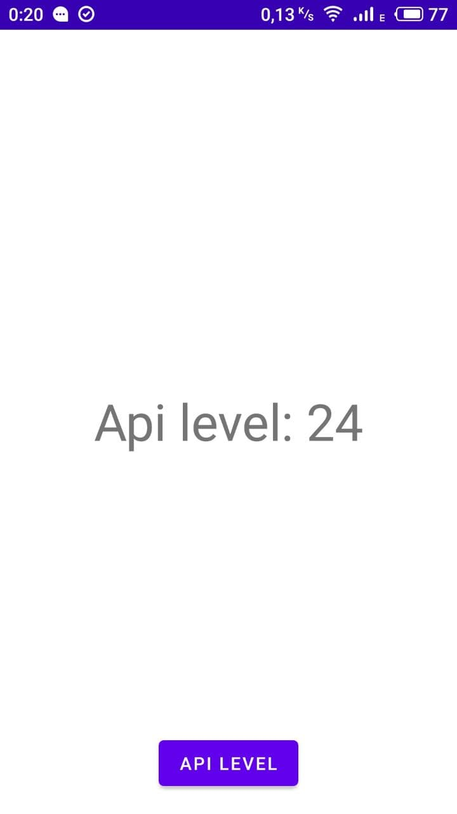

# Api Level Checker
application to find out the api level of the device

The simpliest application to find out the api level of the device. You need to click on the button "Api Level" to find out the api level.

  
  

